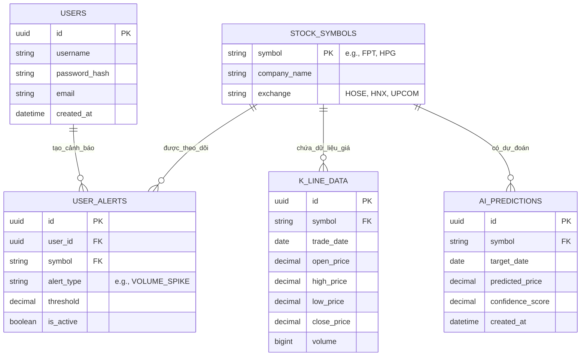

# Database Design & Schema Architecture

Tài liệu này mô tả chi tiết thiết kế lưu trữ dữ liệu của nền tảng Stock Prediction, bao gồm **Cold Storage (PostgreSQL)** dùng để lưu trữ dữ liệu bền vững (Batch) và **Speed Cache (Redis)** dùng cho dữ liệu siêu tốc (Real-time).

## 1. PostgreSQL Schema (Cold Storage)
Đây là cơ sở dữ liệu chính của hệ thống (Single Source of Truth). Nó lưu trữ thông tin User, dữ liệu lịch sử EOD (End of Day) và các dự đoán dài hạn từ AI.

### Entity Relationship Diagram (ERD)

### Chi tiết các Bảng (Tables):
- **`USERS`**: Quản lý tài khoản nhà đầu tư.
- **`STOCK_SYMBOLS`**: Danh mục mã cổ phiếu hỗ trợ. Đóng vai trò là bảng Master Data.
- **`K_LINE_DATA`**: Bảng siêu to khổng lồ chứa dữ liệu lịch sử (EOD). Bảng này cần được đánh Index (Partitioning) theo `trade_date` và `symbol` để tối ưu truy vấn nạp vào AI.
- **`AI_PREDICTIONS`**: Lưu lại kết quả chạy qua đêm của Kronos AI.
- **`USER_ALERTS`**: Lưu cấu hình cảnh báo Real-time của user (Ví dụ: Báo cho tôi khi Volume của HPG tăng gấp 3).

---

## 2. Redis Data Structures (Speed Cache)
Để đáp ứng tốc độ phản hồi tính bằng mili-giây cho sơ đồ C4 Level 2 (Luồng Speed Layer), Redis được sử dụng làm In-Memory DB.

### Thiết kế Key-Value:

1. **Intraday Candles (Nến trong phiên)**
   - **Key:** `market:intraday:candles:{symbol}` (VD: `market:intraday:candles:FPT`)
   - **Data Type:** `Sorted Set (ZSET)`
   - **Mô tả:** Chứa các cây nến 1 phút trong ngày. Score của ZSET chính là UNIX timestamp để dễ dàng query: "Lấy 20 cây nến gần nhất". Dữ liệu bay màu (TTL) vào cuối ngày vì K_LINE_DATA (Postgres) sẽ lo phần lịch sử.

2. **Real-time Spike Lock (Chống Spam Cảnh Báo)**
   - **Key:** `alert:spike:lock:{symbol}`
   - **Data Type:** `String (với TTL = 5 phút)`
   - **Mô tả:** Khi hệ thống phát hiện khối lượng HPG đột biến, nó bắn Alert qua Kafka và Set key này bằng 1. Nếu 2 phút sau khối lượng lại đột biến, Rule Engine check thấy key này vẫn còn (chưa hết TTL), nó sẽ bỏ qua để không spam màn hình User.

3. **Latest Prediction Cache**
   - **Key:** `cache:prediction:latest:{symbol}`
   - **Data Type:** `JSON / String`
   - **Mô tả:** Lưu lại kết quả dự đoán (từ bảng AI_PREDICTIONS) để API của Spring Boot có thể trả về cho Web Dashboard ngay lập tức mà không cần Hits vào PostgreSQL.
