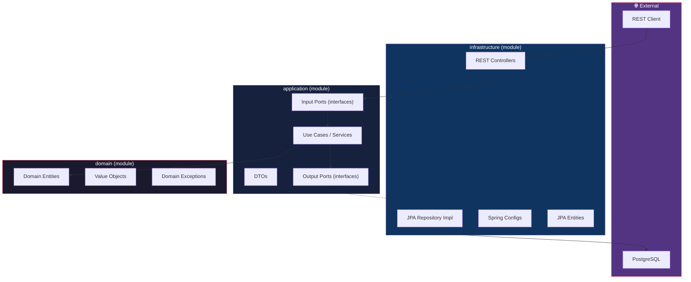

# Spring Boot Clean Architecture Project

Khởi tạo một Java Spring Boot project sử dụng **Clean Architecture** (còn gọi là Hexagonal/Ports & Adapters Architecture) với cấu trúc multi-module Maven.

## Thông số kỹ thuật

| Config | Value |
|---|---|
| Java | 21 (LTS) |
| Spring Boot | 3.4.x |
| Build Tool | Maven (multi-module) |
| Database | PostgreSQL |
| Dependencies | Spring Web, Lombok, Swagger/OpenAPI |

---

## Clean Architecture Overview



### Dependency Rule (quan trọng nhất)

> [!IMPORTANT]
> Dependencies chỉ đi **từ ngoài vào trong**: `infrastructure` → `application` → `domain`. Layer bên trong **KHÔNG BAO GIỜ** phụ thuộc vào layer bên ngoài.

- **domain**: Không phụ thuộc vào bất kỳ module nào khác. Chứa business logic thuần túy.
- **application**: Chỉ phụ thuộc vào `domain`. Định nghĩa use cases và ports.
- **infrastructure**: Phụ thuộc vào `application` và `domain`. Chứa các implementation cụ thể (REST, JPA, configs).

---

## Proposed Changes

### Module Structure

```
javaFirstProject/
├── pom.xml                          # Parent POM (multi-module)
├── domain/
│   ├── pom.xml
│   └── src/main/java/com/example/domain/
│       ├── model/
│       │   └── User.java            # Domain Entity (POJO thuần)
│       ├── exception/
│       │   ├── DomainException.java
│       │   └── ResourceNotFoundException.java
│       └── valueobject/             # (placeholder, mở rộng sau)
├── application/
│   ├── pom.xml
│   └── src/main/java/com/example/application/
│       ├── port/
│       │   ├── in/
│       │   │   └── UserServicePort.java      # Input Port (interface)
│       │   └── out/
│       │       └── UserPersistencePort.java   # Output Port (interface)
│       ├── service/
│       │   └── UserService.java               # Use Case implementation
│       └── dto/
           ├── UserRequestDto.java
           └── UserResponseDto.java
└── infrastructure/
    ├── pom.xml
    └── src/main/java/com/example/infrastructure/
        ├── Application.java          # @SpringBootApplication entry point
        ├── adapter/
        │   ├── in/
        │   │   └── web/
        │   │       ├── UserController.java     # REST Controller
        │   │       └── GlobalExceptionHandler.java
        │   └── out/
        │       └── persistence/
        │           ├── entity/
        │           │   └── UserJpaEntity.java  # JPA Entity
        │           ├── repository/
        │           │   └── UserJpaRepository.java  # Spring Data JPA Repo
        │           └── adapter/
        │               └── UserPersistenceAdapter.java  # Implements Output Port
        └── config/
            ├── BeanConfig.java       # Manual bean wiring
            ├── OpenApiConfig.java    # Swagger config
            └── application.yml       # Spring Boot config
```

---

### [NEW] Parent Module — `pom.xml`

Root POM quản lý multi-module project. Định nghĩa:
- Spring Boot 3.4.x parent
- Java 21
- Khai báo 3 sub-modules: `domain`, `application`, `infrastructure`
- Dependency management chung (Lombok, OpenAPI)

---

### [NEW] Domain Module — `domain/`

**Không có Spring dependency.** Module này là Java thuần.

#### [NEW] `User.java`
- Domain entity đại diện cho User
- POJO thuần, không có JPA annotations
- Sử dụng Lombok cho boilerplate

#### [NEW] `DomainException.java` / `ResourceNotFoundException.java`
- Custom exceptions cho domain logic

---

### [NEW] Application Module — `application/`

**Chỉ depend vào `domain`.** Không có Spring Web/JPA dependency.

#### [NEW] `UserServicePort.java` (Input Port)
- Interface định nghĩa các use case: `createUser`, `getUserById`, `getAllUsers`, `updateUser`, `deleteUser`

#### [NEW] `UserPersistencePort.java` (Output Port)
- Interface định nghĩa persistence operations
- Implementation sẽ nằm ở `infrastructure`

#### [NEW] `UserService.java`
- Implements `UserServicePort`
- Sử dụng `UserPersistencePort` để tương tác với persistence layer
- Chứa business logic

#### [NEW] `UserRequestDto.java` / `UserResponseDto.java`
- DTOs cho input/output của use cases

---

### [NEW] Infrastructure Module — `infrastructure/`

**Depend vào cả `application` và `domain`.** Chứa tất cả Spring Boot dependencies.

#### [NEW] `Application.java`
- Spring Boot main class, `@SpringBootApplication`

#### [NEW] `UserController.java`
- REST Controller với CRUD endpoints cho User
- Sử dụng Swagger annotations
- Gọi Input Port, không gọi trực tiếp service implementation

#### [NEW] `GlobalExceptionHandler.java`
- `@RestControllerAdvice` xử lý exceptions toàn cục

#### [NEW] `UserJpaEntity.java`
- JPA Entity, mapping với database table
- Tách biệt hoàn toàn với Domain Entity

#### [NEW] `UserJpaRepository.java`
- Spring Data JPA Repository interface

#### [NEW] `UserPersistenceAdapter.java`
- Implements `UserPersistencePort` (Output Port)
- Chuyển đổi giữa Domain Entity ↔ JPA Entity
- Sử dụng `UserJpaRepository` để thao tác DB

#### [NEW] `BeanConfig.java`
- `@Configuration` class để wire beans thủ công
- Kết nối Input Port → Service → Output Port

#### [NEW] `OpenApiConfig.java`
- Cấu hình Swagger UI

#### [NEW] `application.yml`
- Cấu hình Spring Boot, PostgreSQL connection, JPA settings

---

## User Review Required

> [!IMPORTANT]
> **Base package name**: Tôi sẽ sử dụng `com.example` làm base package. Bạn có muốn đổi thành package name khác không? (VD: `com.yourcompany.projectname`)

> [!NOTE]
> **Demo entity**: Project sẽ bao gồm một `User` entity mẫu với CRUD operations hoàn chỉnh để minh họa cách Clean Architecture hoạt động. Bạn có thể dùng nó làm template khi thêm các entity mới.

---

## Verification Plan

### Automated Tests
```bash
mvn clean compile          # Verify compilation
mvn spring-boot:run -pl infrastructure  # Verify app starts
```

### Manual Verification
- Kiểm tra Swagger UI tại `http://localhost:8080/swagger-ui.html`
- Test CRUD endpoints qua Swagger UI hoặc curl
- Verify dependency rule: `domain` module không import bất kỳ Spring class nào
